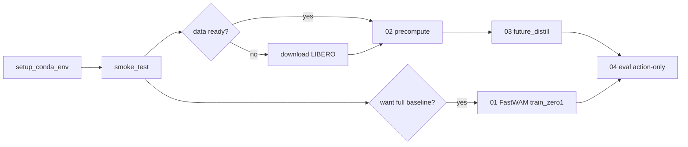

# 实验运行指南（World2WAM Minimal）

## 0. 后台跑大任务（关 Cursor 也不断）

在服务器上执行，使用 `nohup` 脱离终端：

```bash
cd /DATA/disk1/yjh_space/idea2_workspace/minimal_world2wam

# 一键：下载资源 + Pipeline B（02→03→04）
bash scripts/bg_launch.sh full_pipeline

# 只看下载
bash scripts/bg_launch.sh download_assets

# 查看状态 / 跟日志
bash scripts/bg_launch.sh status
bash scripts/bg_launch.sh tail full_pipeline
```

- 日志：`experiments/bg_jobs/full_pipeline.log`
- PID：`experiments/bg_jobs/full_pipeline.pid`

## 1. 创建 Conda 环境

```bash
cd /DATA/disk1/yjh_space/idea2_workspace/minimal_world2wam
bash scripts/setup_conda_env.sh
conda activate world2wam
```

重装环境：

```bash
RECREATE=1 bash scripts/setup_conda_env.sh
```

## 2. 前置资产检查清单

| 资产 | 路径 / 命令 | 用途 |
|------|-------------|------|
| Wan2.2-TI2V-5B | `FastWAM/checkpoints/` + `DIFFSYNTH_MODEL_BASE_PATH` | 模型加载、VAE |
| ActionDiT backbone | `FastWAM/checkpoints/ActionDiT_linear_interp_Wan22_alphascale_1024hdim.pt` | `preprocess_action_dit_backbone.py` |
| LIBERO LeRobot 数据 | `FastWAM/data/libero_mujoco3.3.2/*_lerobot/` | 训练 / 预计算 |
| T5 text cache（全量 FastWAM 训练） | `precompute_text_embeds.py` | 原仓库 baseline 训练 |
| FastWAM finetuned ckpt（可选） | `runs/` 或 HuggingFace | eval / distill 初始化 |

数据下载（FastWAM README）：

```bash
cd /DATA/disk1/yjh_space/idea2_workspace/code/FastWAM
mkdir -p data/libero_mujoco3.3.2
# 从 https://huggingface.co/datasets/yuanty/LIBERO-fastwam 下载 tar.gz 并解压
```

模型准备：

```bash
cd /DATA/disk1/yjh_space/idea2_workspace/code/FastWAM
export DIFFSYNTH_MODEL_BASE_PATH="$(pwd)/checkpoints"
python scripts/preprocess_action_dit_backbone.py \
  --model-config configs/model/fastwam.yaml \
  --output checkpoints/ActionDiT_linear_interp_Wan22_alphascale_1024hdim.pt \
  --device cuda --dtype bfloat16
# 按 FastWAM README 下载 Wan 权重到 checkpoints/
```

## 3. 框架分层测试

```bash
conda activate world2wam
cd /DATA/disk1/yjh_space/idea2_workspace/minimal_world2wam
bash scripts/smoke_test_framework.sh
```

- **Tier 0**：不依赖 FastWAM 权重（head / loss / cache）
- **Tier 1**：`import fastwam`
- **Tier 2**：LeRobot 数据集（需数据目录）
- **Tier 3**：加载完整 `FastWAMWrapper`（需 checkpoints）

## 4. 实验流水线（minimal_world2wam）

### 4.1 预计算 future latent

```bash
conda activate world2wam
cd minimal_world2wam
bash scripts/02_precompute_future_latents.sh
# 调试: --max-samples 100
```

输出：`data/future_latents/world2wam_minimal/*.pt`

若数据不在默认路径，编辑 `configs/fastwam_future_distill.yaml`：

```yaml
lerobot_dataset_dirs:
  - /abs/path/to/libero_spatial_no_noops_lerobot
  # ...
```

### 4.2 Future latent distillation（只训 head）

```bash
bash scripts/03_train_future_distill.sh
```

产物：

- `experiments/future_latent_distill/checkpoints/future_head_final.pt`
- `experiments/future_latent_distill/logs/*.json`

### 4.3 Action-only 评估

```bash
bash scripts/04_eval_action_only.sh --max-batches 5
# 有 FastWAM ckpt 时:
bash scripts/04_eval_action_only.sh --checkpoint /path/to/ckpt.pt
```

### 4.4 FastWAM baseline（原仓库全量训练）

不修改 FastWAM 源码，委托其脚本：

```bash
bash scripts/01_run_fastwam_baseline.sh
# 或:
cd ../code/FastWAM && bash scripts/train_zero1.sh 8 task=libero_uncond_2cam224_1e-4
```

### 4.5 LIBERO 仿真成功率（原仓库 eval）

```bash
conda activate world2wam
cd ../code/FastWAM
python experiments/libero/eval_libero_single.py ckpt=/path/to/checkpoint
```

## 5. 推荐首次实验顺序



## 6. 常见问题

| 现象 | 处理 |
|------|------|
| `future_latent is missing` | 先跑 `02_precompute_future_latents.sh` |
| `Repository path does not exist` | 检查 config 中 `fastwam_root` |
| `dataset` Tier 2 SKIP | 下载 LeRobot LIBERO 到 `FastWAM/data/...` |
| Tier 3 SKIP | 准备 Wan + ActionDiT checkpoint |
| CUDA OOM | 减小 `batch_size`；precompute 用 `--max-samples` |

## 7. 环境变量

```bash
export WORLD2WAM_CONDA_ENV=world2wam
export DIFFSYNTH_MODEL_BASE_PATH=/DATA/disk1/yjh_space/idea2_workspace/code/FastWAM/checkpoints
```
